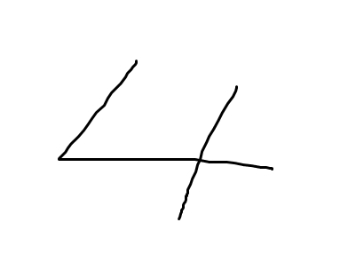
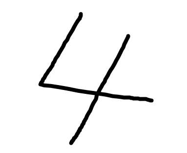
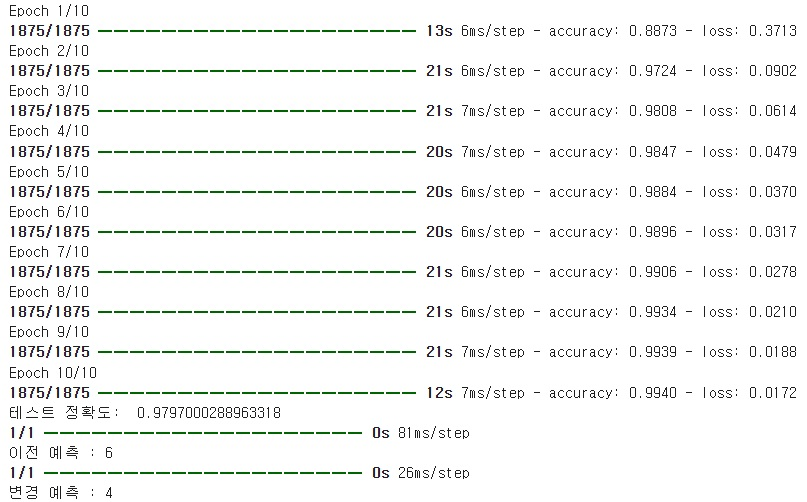
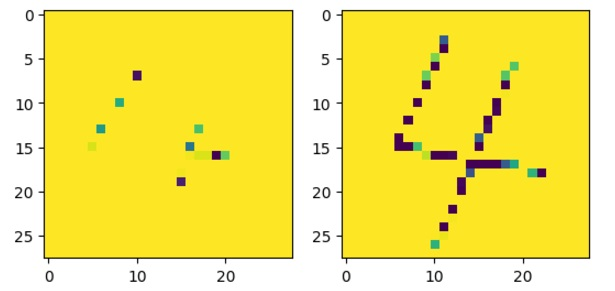

```python
# 과제1
import matplotlib.pyplot as plt
import numpy as np
import tensorflow as tf
from tensorflow import keras
import matplotlib.image as mpimg
import matplotlib.pyplot as plt
import cv2

mnist = keras.datasets.mnist
(train_images, train_labels), (test_images, test_labels) = mnist.load_data()

model = keras.Sequential([
    keras.layers.Flatten(input_shape=(28, 28)),
    keras.layers.Dense(256, activation='relu'),
    keras.layers.Dense(128, activation='relu'),
    keras.layers.Dense(100, activation='relu'),
    keras.layers.Dense(10, activation='softmax')
])

model.compile(optimizer='adam',
              loss='sparse_categorical_crossentropy',
              metrics=['accuracy'])

train_images, test_images = train_images /255, test_images/255

model.fit(train_images, train_labels, epochs=10, verbose=1)

test_loss, test_acc = model.evaluate(test_images, test_labels, verbose = 0)
print("테스트 정확도: ", test_acc)

fig = plt.figure()
ax1 = fig.add_subplot(1, 2, 1)
ax2 = fig.add_subplot(1, 2, 2)

img4 = cv2.imread('./Num_4.png', cv2.IMREAD_GRAYSCALE)
img4 = cv2.resize(img4, (28, 28))
ax1.imshow(img4)

img4_modify = cv2.imread('./Num_4_Modify.png', cv2.IMREAD_GRAYSCALE)
img4_modify = cv2.resize(img4_modify, (28, 28))
ax2.imshow(img4_modify)

img4 = (255 - img4) / 255
pred = model.predict(img4[np.newaxis, :, :])
print('이전 예측 :', pred.argmax())

img4_modify = (255 - img4_modify) / 255
pred = model.predict(img4_modify[np.newaxis, :, :])
print('변경 예측 :', pred.argmax())
```

# 1번째 데이터
<p align="left">
 
</p>

# 2번째 데이터
<p align="left">
 
</p>

# 결과
<p align="left">
 
 
</p>
