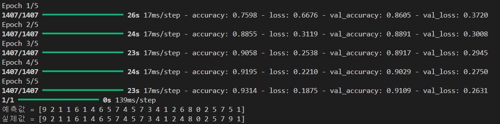
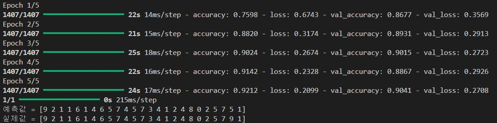
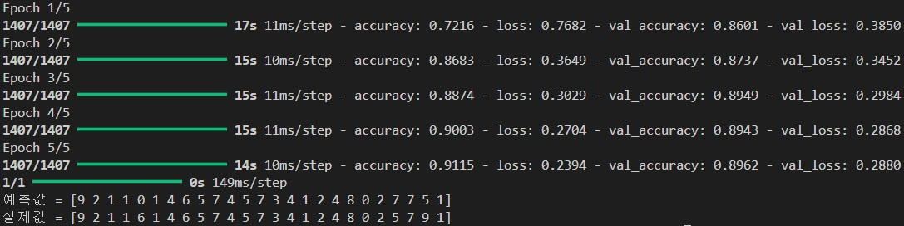

```python
# 과제1
import tensorflow as tf
from tensorflow import keras
import numpy as np
import matplotlib.pyplot as plt

fashion_mnist = keras.datasets.fashion_mnist
(train_images, train_labels), (test_images, test_labels) = fashion_mnist.load_data()

train_images = train_images[:, :, :, np.newaxis]
test_images = test_images[:, :, :, np.newaxis]
train_images, test_images = train_images / 255, test_images / 255
model = keras.models.Sequential([
    keras.layers.Conv2D(input_shape = (28, 28, 1),
                        kernel_size = (3, 3), padding = 'same',
                        filters = 32),
    keras.layers.MaxPooling2D((2, 2), strides=2),
    keras.layers.Conv2D(kernel_size = (3, 3), padding = 'same',
                        filters = 64),
    keras.layers.MaxPooling2D((2, 2), strides=2),
    keras.layers.Conv2D(kernel_size = (3, 3), padding = 'same',
                        filters = 32),
    keras.layers.Flatten(),
    keras.layers.Dense(128, activation = 'relu'),
    keras.layers.Dense(32, activation = 'relu'),
    keras.layers.Dense(10, activation = 'softmax'),
])
model.summary()

model.compile(optimizer='adam',
              loss='sparse_categorical_crossentropy',
              metrics=['accuracy'])
hist = model.fit(train_images, train_labels, epochs=5, validation_split=0.25)

mnist_lbl = ['T-shirt', 'Trouser', 'Pullover', 'Dress', 'Coat',
             'Sandal', 'Shirt', 'Sneaker', 'Bag', 'Ankle_boot']
images = test_images[:25]
pred = np.argmax(model.predict(images), axis = 1)
print('예측값 =', pred)
print('실제값 =', test_labels[:25])
```

# 결과
<p align="left">
 
</p>

```python
# MaxPlooling2D ((3,3), strides=2) 로 변경

model = keras.models.Sequential([
    keras.layers.Conv2D(input_shape = (28, 28, 1),
                        kernel_size = (3, 3), padding = 'same',
                        filters = 32),
    keras.layers.MaxPooling2D((3, 3), strides=2),
    keras.layers.Conv2D(kernel_size = (3, 3), padding = 'same',
                        filters = 64),
    keras.layers.MaxPooling2D((3, 3), strides=2),
    keras.layers.Conv2D(kernel_size = (3, 3), padding = 'same',
                        filters = 32),
    keras.layers.Flatten(),
    keras.layers.Dense(128, activation = 'relu'),
    keras.layers.Dense(32, activation = 'relu'),
    keras.layers.Dense(10, activation = 'softmax'),
])
model.summary()

model.compile(optimizer='adam',
              loss='sparse_categorical_crossentropy',
              metrics=['accuracy'])
hist = model.fit(train_images, train_labels, epochs=5, validation_split=0.25)

mnist_lbl = ['T-shirt', 'Trouser', 'Pullover', 'Dress', 'Coat',
             'Sandal', 'Shirt', 'Sneaker', 'Bag', 'Ankle_boot']
images = test_images[:25]
pred = np.argmax(model.predict(images), axis = 1)
print('예측값 =', pred)
print('실제값 =', test_labels[:25])
```

# MaxPlooling2D ((3,3), strides=2) 로 변경 결과
<p align="left">
 
</p>

```python
# MaxPlooling2D ((2,2), strides=3) 로 변경

model = keras.models.Sequential([
    keras.layers.Conv2D(input_shape = (28, 28, 1),
                        kernel_size = (3, 3), padding = 'same',
                        filters = 32),
    keras.layers.MaxPooling2D((3, 3), strides=2),
    keras.layers.Conv2D(kernel_size = (3, 3), padding = 'same',
                        filters = 64),
    keras.layers.MaxPooling2D((3, 3), strides=2),
    keras.layers.Conv2D(kernel_size = (3, 3), padding = 'same',
                        filters = 32),
    keras.layers.Flatten(),
    keras.layers.Dense(128, activation = 'relu'),
    keras.layers.Dense(32, activation = 'relu'),
    keras.layers.Dense(10, activation = 'softmax'),
])
model.summary()

model.compile(optimizer='adam',
              loss='sparse_categorical_crossentropy',
              metrics=['accuracy'])
hist = model.fit(train_images, train_labels, epochs=5, validation_split=0.25)

mnist_lbl = ['T-shirt', 'Trouser', 'Pullover', 'Dress', 'Coat',
             'Sandal', 'Shirt', 'Sneaker', 'Bag', 'Ankle_boot']
images = test_images[:25]
pred = np.argmax(model.predict(images), axis = 1)
print('예측값 =', pred)
print('실제값 =', test_labels[:25])
```

# MaxPlooling2D ((2,2), strides=3) 로 변경 결과
<p align="left">
 
</p>
