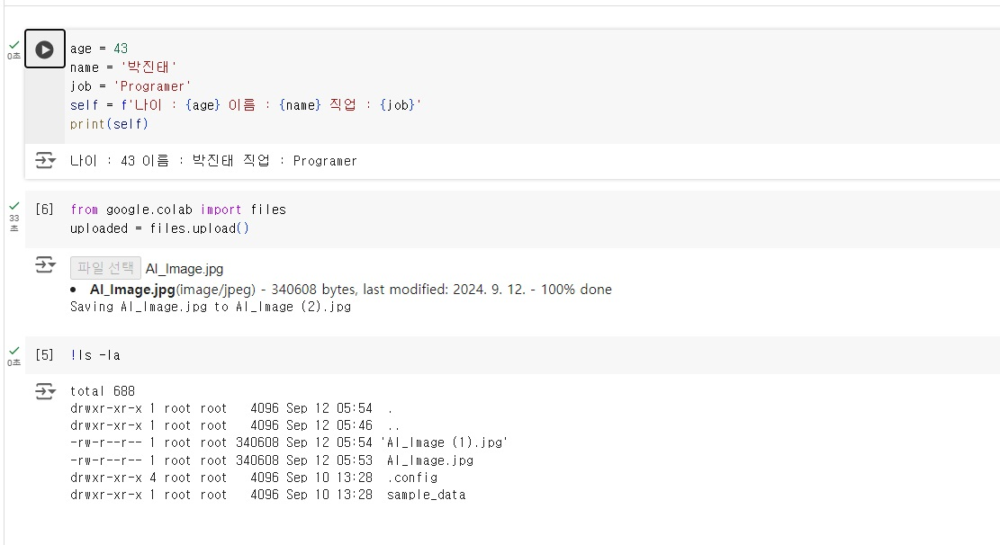

```python
# 과제1
age = 43
name = '박진태'
job = 'Programer'
self = f'나이 : {age} 이름 : {name} 직업 : {job}'
print(self)

from google.colab import files
uploaded = files.upload()

!ls -la


```
# 결과
<p align="left">
 
</p>
