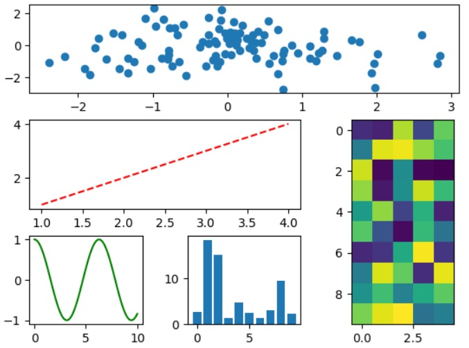

```python
# 과제1
import matplotlib.pyplot as plt
import numpy as np

fig, ax = plt.subplots(3, 3)

grid = plt.GridSpec(3, 3, wspace=0.4, hspace=0.3)

X = np.random.randn(100)
Y = np.random.randn(100)
plt.subplot(grid[0, :]).scatter(X, Y)

X = np.arange(1, 5)
Y = X
plt.subplot(grid[1, :2]).plot(X, Y, 'r--')


X = np.linspace(0, 10, 100)
Y = np.cos(X)
plt.subplot(grid[2, 0]).plot(X, Y, color = 'g')

X = np.arange(10)
Y = np.abs(np.random.randn(10) * 10)
plt.subplot(grid[2, 1]).bar(X, Y)

Z = np.random.uniform(0, 1, (10,5))
plt.subplot(grid[1:, 2]).imshow(Z)
```
# 결과
<p align="left">
 
</p>

```python
# 과제2
import matplotlib.pyplot as plt
import numpy as np

fig, ax = plt.subplots(2, 3)

grid = plt.GridSpec(2, 3, wspace=0.4, hspace=0.3)

X = np.random.randn(100)
Y = np.random.randn(100)
plt.subplot(grid[0, 0]).scatter(X, Y)

X = np.arange(10)
Y = np.random.uniform(1, 10, 10)
plt.subplot(grid[0, 1:]).bar(X, Y)

X = np.linspace(0, 10, 100)
Y = np.cos(X)
plt.subplot(grid[1, :2]).plot(X, Y)

Z = np.random.uniform(0, 1, (5,5))
plt.subplot(grid[1, 2]).imshow(Z)
```
# 결과
<p align="left">
 
</p>
