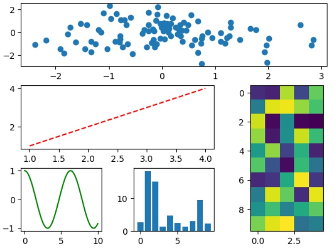

```python
# 과제1
result = np.array([])
for i in range(3):
  a = np.arange(1, 46)
  np.random.shuffle(a)
  lotto = a[:6]
  result = np.append(result, lotto)
print(result)
result = np.reshape(result, (3, 6))
print(result)
```
# 결과
<p align="left">
 
</p>
```python
# 과제2
import numpy as np
shape = (3, 3, 6)
arr = np.random.randint(0, 21, shape)
print(arr)

shape = (3, 6)
arr = np.random.randint(0, 101, shape)
print(arr)
```
# 결과
<p align="left">
 
</p>
