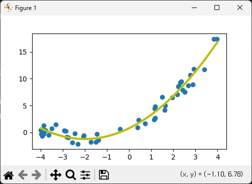

```python
# 과제1
import matplotlib.pyplot as plt
import numpy as np
import pandas as pd
from sklearn.linear_model import LinearRegression

m = 50
X = 8 * np.random.rand(m, 1) - 4
y = 0.5 * X ** 2 + 2 * X + 1 + np.random.randn(m, 1)

poly_features = PolynomialFeatures(degree=2, include_bias = True)
x_poly = poly_features.fit_transform(X)
regr = LinearRegression()
regr.fit(x_poly, y)
print('다항 회귀 모델의 점수 =', regr.score(x_poly, y))
print('다항 회귀 모델의 계수 =', regr.coef_, '절편 =', regr.intercept_)

domain = np.linspace(-4, 4, 50).reshape(-1, 1)
print(domain)
domain2 = poly_features.fit_transform(domain)
print(domain2)
plt.figure(figsize=(5,3))
y_predict = regr.predict(domain2)
plt.scatter(X, y)
plt.plot(domain, y_predict, color='y', linewidth=3)
plt.show()
```
# 결과
<p align="left">
 
</p>
