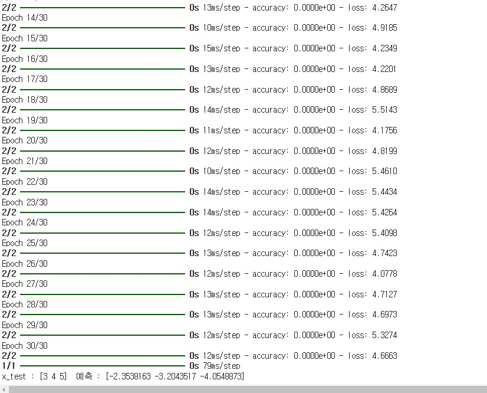

```python
# 과제1
import numpy as np
import tensorflow as tf
from tensorflow import keras

x_train = np.array([[0], [1], [2]])
y_train = 3 * x_train + 1
x_test = np.array([[3], [4], [5]])
y_test = 3 * x_test + 1

model = keras.models.Sequential()
model.add(keras.layers.Dense(4, input_shape=(1, )))
model.add(keras.layers.Dense(1))

model.compile(loss='mean_absolute_error', optimizer='adam', metrics=['accuracy'])
model.fit(x_train, y_train, epochs=30, batch_size=2)

pred = model.predict(x_test)
print('x_test :', x_test.flatten(), ' 예측 :', pred.flatten())
```
# 결과
<p align="left">
 
</p>


# 1) 손실함수의 의미
## 모델이 예측한 값과 실제 값 사이의 차이를 나타내며, 이 차이를 줄이도록 모델을 학습시키는 지표로 사용됩니다. 대표적인 손실 함수는 다음과 같습니다.
- Mean Squared Error (MSE): 회귀 문제에서 많이 사용되며, 예측값과 실제값의 차이를 제곱하여 평균을 구합니다.
```python
loss='mean_squared_error'
```
- Mean Absolute Error (MAE): 예측값과 실제값 사이의 차이를 절대값으로 평균하여 계산합니다. 이상치에 덜 민감합니다.
```python
loss='mean_absolute_error'
```
- Binary Crossentropy: 이진 분류 문제에서 사용되며, 실제 값이 0 또는 1일 때 그에 맞는 확률 예측을 기반으로 오차를 계산합니다.
```python
loss='binary_crossentropy'
```
- Categorical Crossentropy: 다중 분류 문제에서 사용되며, 실제 값과 예측 확률 사이의 차이를 나타냅니다.
```python
loss='categorical_crossentropy'
```

# 2) 최적화함수의 의미
## 손실 함수를 최소화하기 위해 모델의 가중치를 업데이트하는 방법을 결정합니다. 대표적인 최적화 함수는 다음과 같습니다.

- SGD (Stochastic Gradient Descent): 기본적인 경사 하강법으로, 각 데이터 샘플마다 가중치를 업데이트합니다.
```python
optimizer='sgd'
```
- Adam: Adaptive Moment Estimation의 줄임말로, 학습 속도와 정확성을 동시에 높이는 방식으로 널리 사용됩니다
```python
optimizer='adam'
```
- RMSprop: 가중치의 업데이트 비율을 조절하여 학습을 안정화합니다. 주로 순환 신경망(RNN)에서 많이 사용됩니다.
```python
optimizer='rmsprop'
```
- Adagrad: 각 파라미터마다 적응적으로 학습률을 조정하여, 학습 초기에는 큰 보폭으로 이동하고 이후에는 천천히 이동하도록 합니다.
```python
optimizer='adagrad'
```
# 3) deep learning 에서 손실함수와 최적화함수의 역할
## 딥러닝 모델의 학습에는 손실 함수와 최적화 함수가 중요한 역할을 합니다. 이 두 함수는 모델이 목표를 향해 학습하는 데 핵심적인 요소로, 각각의 역할과 사용 방법을 아래와 같이 정리할 수 있습니다.

### 1. 손실 함수 (Loss Function)
### 역할 : 손실 함수는 모델이 예측한 값과 실제 값 사이의 차이를 측정하여 학습 과정에서 오차를 정량화하는 역할을 합니다.
### 이 함수는 모델이 얼마나 잘 학습하고 있는지 또는 얼마나 개선해야 하는지를 판단하는 지표로 사용되며, 손실 함수의 결과값이 작아질수록 예측이 실제 값과 가까워진다는 것을 의미합니다.

### 2. 최적화 함수 (Optimizer)
### 역할 : 최적화 함수는 손실 함수로부터 계산된 오차를 최소화하기 위해 가중치와 바이어스 등의 파라미터를 업데이트하는 알고리즘입니다. 손실 함수의 값이 최소가 되도록 조정하여 학습 과정을 진행합니다. 최적화 함수는 학습의 속도와 안정성을 결정하는 중요한 요소입니다.
### 정리 : 손실 함수는 오차를 정량화하여 모델의 성능을 평가하고, 최적화 함수는 파라미터를 업데이트하여 손실을 줄여 나갑니다. 
### 이 둘의 적절한 조합이 딥러닝 모델의 학습 효율성과 성능에 크게 영향을 미치므로, 문제 유형에 맞게 손실 함수와 최적화 함수를 선택하는 것이 중요합니다.


